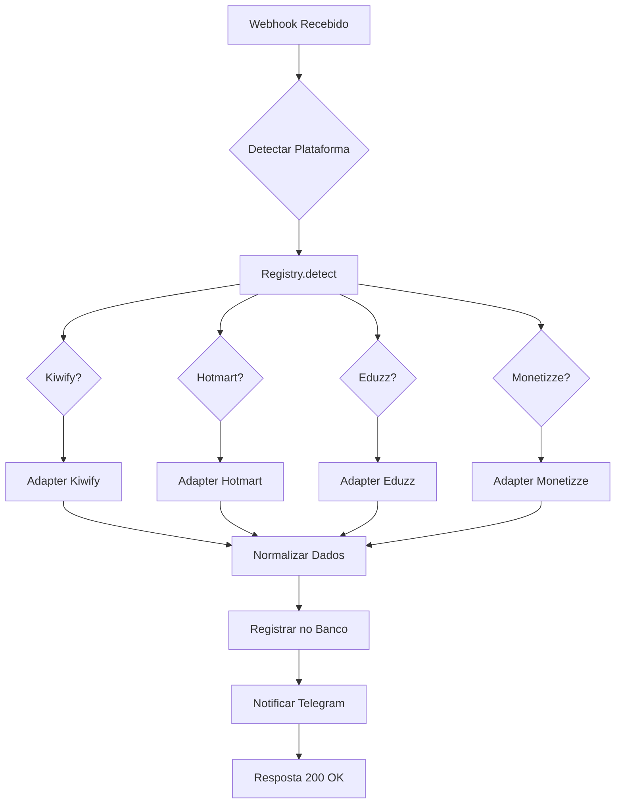

# 🚀 Sistema de Integração com Plataformas de Vendas

## ✅ **Resposta Rápida: NÃO se limita à Kiwify!**

O sistema já suporta **múltiplas plataformas** através de uma arquitetura modular de **adaptadores**.

---

## 🎯 Plataformas Suportadas

Seu sistema **já tem adaptadores** para:

| Plataforma | Arquivo | Status |
|------------|---------|--------|
| **Kiwify** | [`kiwify.adapter.ts`](file:///c:/Users/leandro.teles/Desktop/projetos/insighthub_%20ai/src/lib/platforms/kiwify.adapter.ts) | ✅ Implementado |
| **Hotmart** | [`hotmart.adapter.ts`](file:///c:/Users/leandro.teles/Desktop/projetos/insighthub_%20ai/src/lib/platforms/hotmart.adapter.ts) | ✅ Implementado |
| **Eduzz** | [`eduzz.adapter.ts`](file:///c:/Users/leandro.teles/Desktop/projetos/insighthub_%20ai/src/lib/platforms/eduzz.adapter.ts) | ✅ Implementado |
| **Monetizze** | [`monetizze.adapter.ts`](file:///c:/Users/leandro.teles/Desktop/projetos/insighthub_%20ai/src/lib/platforms/monetizze.adapter.ts) | ✅ Implementado |

---

## 📡 Endpoints Disponíveis

### 1. **Webhook Unificado** (Recomendado)
```
POST /api/webhook/unified?user_id=SEU-UUID
```

**Funciona com TODAS as plataformas automaticamente!**
- ✅ Detecta automaticamente a plataforma
- ✅ Normaliza dados para formato único
- ✅ Registra produto e venda
- ✅ Envia notificação Telegram

---

### 2. **Webhook Específico da Kiwify**
```
POST /api/webhook/kiwify?user_id=SEU-UUID
```

**Otimizado especificamente para Kiwify**

---

### 3. **Webhook Legado** (Kiwify + Hotmart)
```
POST /api/webhook
```

Suporta Kiwify e Hotmart com lógica simples

---

## 🏗️ Arquitetura Modular

### Como Funciona



---

## 🔧 Como Usar Cada Plataforma

### Kiwify
```
URL: https://seu-dominio.vercel.app/api/webhook/unified?user_id=SEU-UUID
```

### Hotmart
```
URL: https://seu-dominio.vercel.app/api/webhook/unified?user_id=SEU-UUID
```

### Eduzz
```
URL: https://seu-dominio.vercel.app/api/webhook/unified?user_id=SEU-UUID
```

### Monetizze
```
URL: https://seu-dominio.vercel.app/api/webhook/unified?user_id=SEU-UUID
```

**É a mesma URL para todas!** O sistema detecta automaticamente. ✨

---

## 🛠️ Como Adicionar Nova Plataforma

Se precisar integrar com **outra plataforma** (ex: Braip, Perfect Pay, etc):

### 1. Criar Adaptador

Crie arquivo [`src/lib/platforms/NOME.adapter.ts`](file:///c:/Users/leandro.teles/Desktop/projetos/insighthub_%20ai/src/lib/platforms/):

```typescript
import { PlatformAdapter, NormalizedData } from './index';

export const NomePlataformaAdapter: PlatformAdapter = {
    name: 'nome_plataforma',
    displayName: 'Nome Plataforma',

    // Detecta se webhook é desta plataforma
    detect(payload: any): boolean {
        return !!payload.campo_unico_desta_plataforma;
    },

    // Normaliza dados para formato padrão
    normalizeData(payload: any): NormalizedData {
        return {
            transactionId: payload.transaction_id,
            customerName: payload.buyer_name,
            customerEmail: payload.buyer_email,
            customerPhone: payload.buyer_phone,
            productId: String(payload.product_id),
            productName: payload.product_name,
            amount: payload.amount / 100, // Se vier em centavos
            status: payload.status === 'approved' ? 'paid' : 'waiting_payment',
            metadata: { /* dados extras */ }
        };
    }
};
```

### 2. Registrar no Registry

Edite [`src/lib/platforms/registry.ts`](file:///c:/Users/leandro.teles/Desktop/projetos/insighthub_%20ai/src/lib/platforms/registry.ts):

```typescript
import { NomePlataformaAdapter } from './nome_plataforma.adapter';

registry.register(NomePlataformaAdapter);
```

**Pronto!** A nova plataforma já funciona automaticamente. ✅

---

## 📊 Verificar Plataformas Suportadas

### Via API (GET)
```bash
curl https://seu-dominio.vercel.app/api/webhook/unified
```

**Resposta:**
```json
{
  "status": "online",
  "version": "2.0.0",
  "supportedPlatforms": [
    { "name": "kiwify", "displayName": "Kiwify" },
    { "name": "hotmart", "displayName": "Hotmart" },
    { "name": "eduzz", "displayName": "Eduzz" },
    { "name": "monetizze", "displayName": "Monetizze" }
  ],
  "totalPlatforms": 4
}
```

---

## 🎯 Resumo

### ✅ **SIM, outras plataformas podem ser integradas!**

**Atualmente suporta:**
- ✅ Kiwify
- ✅ Hotmart  
- ✅ Eduzz
- ✅ Monetizze

**Facilmente expansível para:**
- 🔄 Braip
- 🔄 Perfect Pay
- 🔄 AppMax
- 🔄 Qualquer outra plataforma!

**Arquitetura:**
- ✅ Modular (adaptadores)
- ✅ Detecção automática
- ✅ Dados normalizados
- ✅ Fácil adicionar novas

**Recomendação:**  
Use o **webhook unificado** ([`/api/webhook/unified`](file:///c:/Users/leandro.teles/Desktop/projetos/insighthub_%20ai/src/app/api/webhook/unified/route.ts)) para suportar todas as plataformas com uma única URL! 🚀
